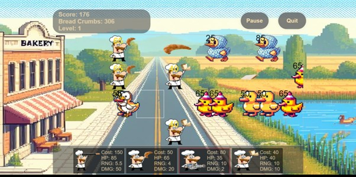

# Hi there, I'm Piers! 

## About Me 

Junior developer with 7 years of engineering problem solving background. Makers Academy graduate 

- 🌍 Languages: **Javascript, CSS, Python, postgres, Mongo, Node, Swift**
- 📫 How to reach me: **[your email address or other contact information]**
- ⚡ Fun fact: **I am a casual sim racer (ACC), keen car and motorcycle enthusiast**

## My Skills 🧠

*Replace the above skill badges with your own skills and expertise. To create more badges, use [checkout this repo])(https://github.com/alexandresanlim/Badges4-README.md-Profile).*

## Featured Projects 💻

### [Bakers Vs Ducks](https://github.com/pierro-yo/bakers-vs-ducks)

**Bakers VS Ducks** is a web based tower defence game based off the popular game "Plants Vs Zombies** built with Javascript, CSS, HTML and Jest.

(https://github.com/pierro-yo/bakers-vs-ducks)

### [Acebook Ios]([project_2_link](https://github.com/siwhelan/swiftui-engineering-project))

Acebook is an app built on IOS which allows you to sign up, log in, create posts, see other peoples posts, like a certain post and view your own profile. Built in Swift on Xcode

## Get in Touch 📬

- **[Personal Website / Blog]**(your_website_or_blog_link)
- **[LinkedIn]**(your_linkedin_profile_link)
